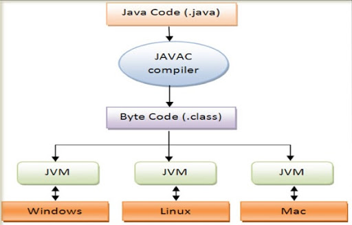

# JAVA 

* IDE : IntelliJ IDEA 2020.2.1

1. [배열](#배열)
  

**자바 실행 과정**   
   
운영체제에 상관없이 바이트 코드 파일은 JVM을 통해서 실행 가능한 기계어로 번역된다.

**패키지**   
자바는 소스 파일 및 컴파일된 바이트 코드 파일들을 기능별로 쉽게 관리하기 위해 패키지를 사용한다. JDK 11 이후 버전부터는 직접 생성하는 프로젝트도 모듈로 활용할 수 있기 때문에 반드시 패키지를 요구한다. JDK 8 이전 버전에선 필수는 아니지만 JDK 버전에 상관없이 패키지 만드는 것이 좋다.

**JAVA Memory 구조?**
- class area, stack, heap

**IntelliJ 단축키**

psvm + TAB : public static void main() 함수 생성

## 배열

```
    int[][] arrays;
    int arrays[][];
    intp[] arrays[];
```
* C++과 기본 개념은 같다. 
  
2차원 배열일 때 주소값은 어떻게 될까???
### 참고
* 『혼자 공부하는 자바』신용권저, 한빛미디어 
