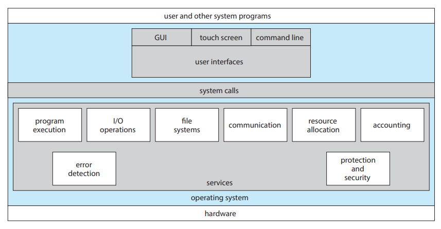
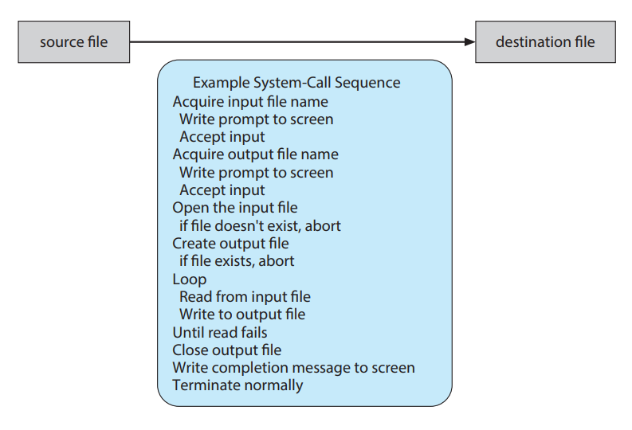
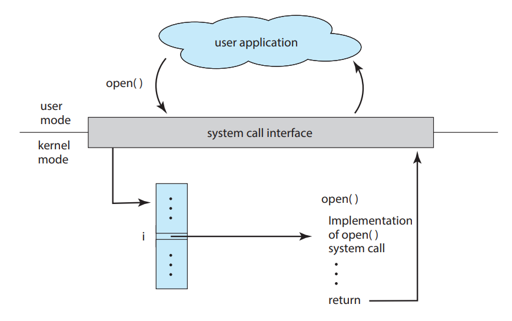
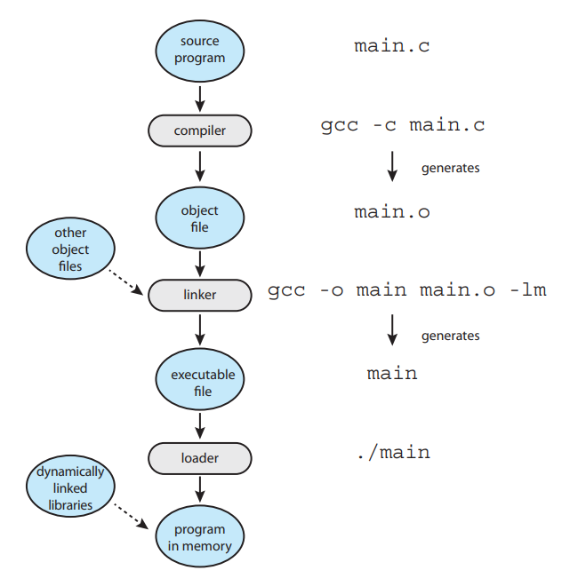
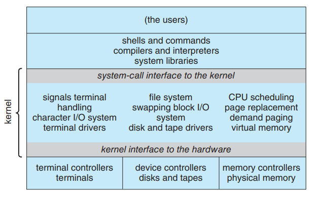
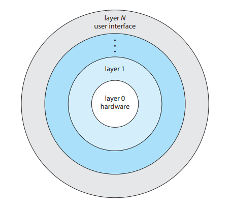
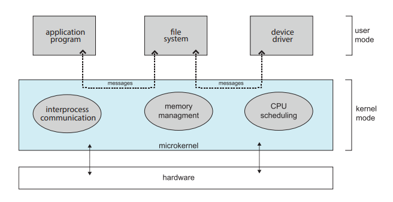

# EDH

~2020.01.03

chapter 2 (p.55 ~ p.105)

# 1. Operating system service

1. User interface
    - CLI
    - GUI
    - Touch screen interface
2. Program execution
3. I/O operations
4. File-system manipulation
5. Communications
6. Error dection
    - Hardware : memory, power failure
    - IO devices : parity error on disk, connection failure on a network
    - User program : arithmetic overflow, access an illegal memory location
7. Resource allocation
8. Logging
9. Protection and security

# Interface

### CLI (Command-line interface)

Shell interpreter을 사용한다. Command interpreter은 명렁어를 메모리에 로드 후 실행시키는 역할만 수행한다.

> rm file.text

1. file.txt memory load
2. execute file
3. process command

CLI 방식에서 새 명령어가 추가되더라도 수정사항이 없고 크기도 작다.

### Touch-Screen Interface

모바일, 태블릿 환경에서 CLI, GUI 방식은 현실정이 없다. 흔히 우리가 쓰는 터치 스크린 인터페이스는 제스쳐, 압력 등을 이용하는 방식이다.

애플의 아이폰, 아이패드는 Springboard라는 Touch screen interface를 이용한다.

# System call

운영체제가 제공하는 인터페이스 언어이다. 

### API (Application Programming Interface)

API는 각 운영체제에서 지원하는 프로그래밍 인터페이스이다.  프로그래머가 API를 사용하는 이유는  아래와 같다.

1. 프로그램 호환성의 이점
    - 프로그래머는 그 함수가 어떻게 구현되어있는지 알 필요도 없으며, 단순히 사용만 하면 된다.
2. System call은 RTE(Run-time environment)에 의해서 실행되기 때문이다.
    - System call엔 번호가 매개져 있으며 테이블 형식으로 관리된다.
    - 그래서 새로운 system call이 추가되더라도 수정 비용이 크지 않다.

API를 통해 System call을 호출할 때 매개변수 저장위치는 파라미터의 개수에 따라 달라진다. 통상적으로 리눅스에서는 파라메터가 5개 이하인 경우 **레지스터**를 이용하고 이보다 클 경우 **메모리 블럭**을 이용한다.

### Type of system call

1. Process control
    - 프로세스의 실행, 정지에 관련된 작업을 수행한다.
    - High level error param의 경우 정상/비정상 경우를 통합해 level 0으로 취급한다.
    - 멀티 프로세스 실행 단계에서 프로세스 우선순위, 프로세스의 속성, 허용된 실행시간등이 이 단계에서 요구된다. (후에 스케쥴링에서 자세히 다룬다)
    - 아두이노에는 OS 대신 SKETCH가 존재한다.
2. File management
3. Device management
    - UNIX에선 IO와 FILE 부분이 유사하다고 판단해 합쳐서 제공하기도 한다.
4. Information maintenance
    - Kernel mode, User mode 사이에 데이터를 전송하는 역할을 한다.
5. Communication
    - IPC다.
    - MSG 송수신 방법은 데이터가 작은 경우에 주로 사용한다
    - 공유 메모리 방식은 속도가 빠른 장점이 있지만 동기화, 무결성 문제가 존재한다.
6. Protection

# Linker and Loaders

10판에서 새로 추가된 영역이다.

1. 소스코드는 컴파일러에 의해 물리 메모리에 위치하기 좋은 relocatable object file 형태로 변환된다.
2. Linker는 다른 obj 파일과 라이브러리를 연결(include)시켜 실행파일을 만든다.
3. loader는 동적인 라이브러리들을 연결하여 프로그램을 메모리에 로드하는 역할을 한다.
    - 윈도우의 DLL 이라는 파일 형태로 동적 라이브러리들을 제공한다.

동적 라이브러리를 쓰는이유

- 라이브러리에 수정이 있을 때 모든 파일을 컴파일하지 않아도 된다.
- 항상 사용하는 코드들이 아니기 때문에 프로그램이 실행되는 동안 메모리에 상주시키지 않아도 된다.

리눅스는 ELF(Executable and Linkable Format) 파일 형식을 사용하고, 윈도우는 PE(Portable Executable) 포맷을, 맥은 Mach-O 포맷을 사용한다.

# OS Structure

위는 전통적인 UNIX 시스템 구조이다. 이는 **모놀리식 구조 (Monolithic structure)** 라고 하는데 입출력, 네트워크 기능 등 운영체제의 일반적 기능을 커널과 동일한 메모리 공간에 로드, 실행하는 구조다.

이 방식은 구현이 어렵고 유지보수가 어려운 단점이 있었다.

위는 **계층적 구조 (Layered structure)** 이다.

layer별로 담당하는 기능이 달라서 구현과 디버깅이 편한 장점이 있지만, 한 기능이 어떤 레이어에 속하게 할지 구분하는데 어려움이 있다는 단점이 있다.

Network의 OSI 계층을 생각해보면 이해가 빠를것이다. 하지만 성능을 중시하는 OS에서 다계층 구조는 비효율적이라 많이 사용되지는 않는다.

위는 **마이크로 커널(Micro kernel)** 구조다.

Layered 방식에 비하면 계층이 적고, Monolithic에 비하면 유지보수가 쉬운 장점이 있다. 하지만 user 영역의 프로세스들이 데이터를 주고 받을 때 kernel 을 거쳐야하는 단점이 있다. 

**Module**의 LKMs(Loadable kernel modules)는 커널이 핵심 기능을 가지고 있고 추가적인 기능은 모듈을 통해 링크한다는 것 이다. 

이 구조에서 커널은 부팅 또는 실행중에 부가적인 서비스들을 **동적으로 링크**한다.

메시지 교환 방식을 사용하지 않아 마이크로 커널 구조보다 비용이 적게 발생한다. 

# Building and Booting and Operating System

일반적인 OS 빌드 과정은 아래와 같다.

1. OS 소스코드 작성

2. OS config 구성

3. OS 컴파일

4. OS 설치

5. Boot

### System boot

1. bootstrap / boot loader라는 작은 코드 조각을 찾는다.
2. 커널은 1을 메모리에 로드해 실행시킨다.
3. 커널이 HW를 초기화 시키고 root filesystem이 마운트된다.

자세한건 리눅스 코드를 까보도록 하자 (...)

# 연습문제

### 2-1. What is the purpose of system call?

일반적으로 저수준 언어인 어셈블리로 실행되야하는 작업을 C와 같은 형태로 유저의 편의를 위해 제공되는 인터페이스이다.

### 2-2. What is the purpose of the command interpreter? Why is it usually separate from the kernel?

Command interpreter은 초기 OS에서 제공된 명령해석기이다. 사용자가 입력한 문장을 해석해 그에 맞는 system call을 호출하는 역할을 한다.

현대 운영체제에선 사용자의 kernel영역에 대한 접근을 엄격하게 금지하고 있다. 이때문에 사용자 수준인 CLI가 커널영역에 포함되지 않는다.

### 2-3. What system calls have to be executed by a command interpreter or shell in order to start a new process on a UNIX system?

fork() → exec()

### 2-4. What is the purpose of system programs?

사용자가 system call을 사용하는 과정에서 편의성 지원을 위해 만들어진 프로그램이다.

예시로는 디버거, 파일 시스템 등이 있다.

### 2-5. What is the main advantage of the layered approach to system design? What are the disadvantage of the layered approach?

레이어드 구조는 모놀리식 구조에 비해 구현, 유지보수가 쉽다는 장점이 있다. 하지만 각 기능들이 어떤 레이어에 속할것인지, 최상위 레이어에서 최하위 레이어까지 소요되는 비용이 커 오버헤드가 발생한다.

### 2-6. List five services provided by an operating system, and explain how each creates convenience for users. In which cases would it be impossible for user-level programs to provixe these services? Explain your answer.

### 2-7. Why do some systems store the operating system in firmware, while other store it on disk?

ROM은 하드웨어와 소프트웨어의 중간적 특성을 같기때문에 펌웨어라고 부른다고 한다. 펌웨어는 가격이 비싸 용량이 크기 않고, RAM에 비해 실행속도가 느린 단점을 갖고있다.

### 2-8. How could a system be designed to allow a choice of operating systems from which to boot? What would the bootstrap program need to do?

boostrap는 커널을 찾아 메모리에 로드하고 실행하는 역할을 한다. 이때 커널을 찾으면 바로 실행하는것이 아니라 선택을 할 수 있도록 하면 어떨까? 

bootstrap는 HW를 초기화하고 root filesystem을 마운트 시키는 일을 한다.